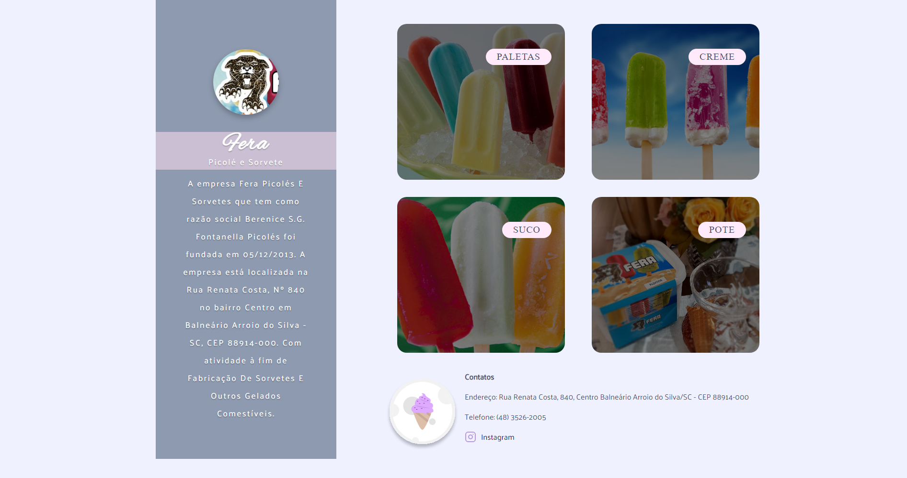
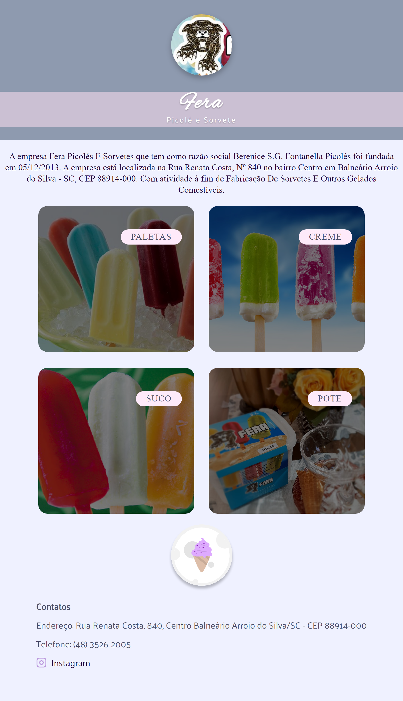

# Criando Projeto Mobile e desktop

>Desafio Turma Explorer 06

Criando projeto responsivo. Layout disponível pela figma.

[🔗Clique aqui para acessar o Projeto]

[🔗Clique aqui para acessar o figma Mobile First](https://www.figma.com/file/OVW2hP6NWXyLOVW5fnTgZI/Stage-03---Mobile-First-(Copy)?node-id=12%3A137)

[🔗Clique aqui para acessar o figma Desktop](https://www.figma.com/file/lBjwsAJS4J9g9JrGixINnb/Stage-03---Grid-com-anima%C3%A7%C3%B5es-(Copy)?node-id=0%3A3)

## 🛠Tecnologias

- HTML
- CSS
- Git e Github
- figma

## Desafio

Desafio proposto após o fim do nível 3 do curso explorer. O desafio era criar uma pagina que trabalhasse com display grid. No desafio era para criar uma pagina para mobile e uma para computador com o mesmo layout.  

## 💛Contato

benedirgomesneto@gmail.com
